<p align="center">
  <a href="https://monkeyclash.assistantstudent.com">
    
  </a>
</p>

<h3 align="center">Monkeytype, mais tu joues contre tes potes. En direct.</h3>

<p align="center">
  <a href="https://monkeyclash.assistantstudent.com"></a>
  
  <a href="LICENSE"></a>
</p>

---

# C'est quoi ?

**MonkeyClash** est un fork de [Monkeytype](https://github.com/monkeytypegame/monkeytype), le meilleur site de dactylo du monde, avec en plus un **mode duel en ligne** :

- tu crées un salon, tu envoies le lien à tes potes ;
- tout le monde reçoit **exactement les mêmes mots** ;
- compte à rebours, **3… 2… 1… go** ;
- tu vois le **curseur de tes adversaires avancer en direct** dans le texte ;
- à la fin, classement, wpm, précision, graphe. Et revanche.

Tu gardes tout ce qui fait Monkeytype : les thèmes, les modes, les langues, le smooth caret…

# Comment ça marche

Depuis des années, l'équipe Monkeytype développe un mode multijoueur appelé **Tribe**. Son interface est dans le code public (branche `newtribemerge`), mais **le serveur qui fait tourner les parties ne l'est pas**.

MonkeyClash part de cette branche et **ajoute son propre serveur temps réel**, écrit à partir du protocole utilisé par le client :

```
 navigateur (client Tribe de Monkeytype)
        │  Socket.IO
        ▼
 serveur MonkeyClash  ── salons, compte à rebours, progression live, résultats
        │
        ▼
 monkeyclash.assistantstudent.com  (auto-hébergé, Docker + tunnel Cloudflare)
```

# Roadmap

- [x] Fork basé sur le client Tribe
- [x] Serveur temps réel compatible Tribe (salons, countdown, progression, résultats) : voir [`tribe-server/`](tribe-server/)
- [x] Chat de salon
- [x] Déploiement sur `monkeyclash.assistantstudent.com` (voir [`deploy/`](deploy/))
- [x] Rebranding : thème `monkeyclash` par défaut, logo « m c. », sans pubs ni merch
- [ ] Comptes, **historique des duels et stats** (victoires, meilleur wpm, head-to-head entre potes)

# Crédits et licence

MonkeyClash est un projet de fans **non affilié à Monkeytype**. Tout le moteur de frappe, l'interface et le client multijoueur viennent du travail de [Miodec](https://github.com/Miodec) et des [contributeurs de Monkeytype](https://github.com/monkeytypegame/monkeytype/graphs/contributors). Allez jouer sur [monkeytype.com](https://monkeytype.com) et soutenez-les !

Comme l'original, ce projet est sous licence [GPL-3.0](LICENSE). Le tag « Clash » utilise la police [Sedgwick Ave Display](https://fonts.google.com/specimen/Sedgwick+Ave+Display) (SIL Open Font License), la bannière se régénère avec `scripts/banner/make_banner.py` et les icônes avec `scripts/branding/`.

L'état du projet, le déploiement et la roadmap sont dans [`docs/MONKEYCLASH.md`](docs/MONKEYCLASH.md).

Le README original de Monkeytype est dans [`docs/MONKEYTYPE_README.md`](docs/MONKEYTYPE_README.md).
